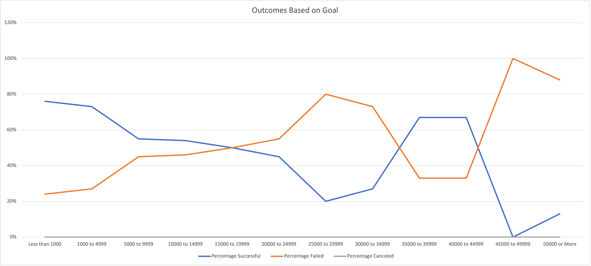
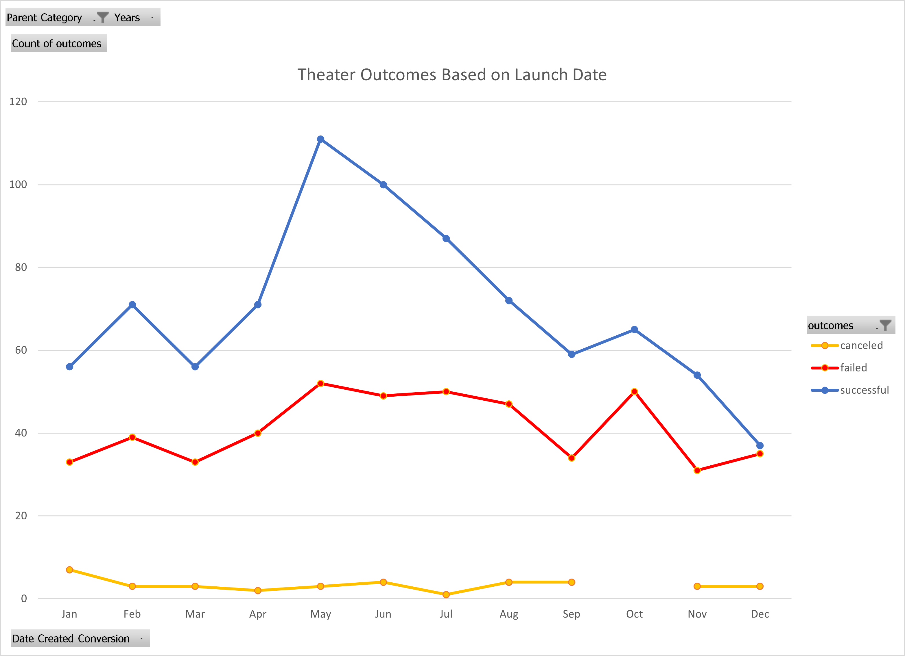

# Kickstarter-Analysis
Analysis on Kickstarter Data

## Overview of Project
* The goal of this project is to analyze the kickstarter data to determine trends. Key trends that were identified were theater outcomes based on launch date and the outcome of the kickstarters based on the size of the goal.

## Analysis and Challenges
### Overview of Analysis

   #### Outcomes vs Goals

* The chart below shows the correlation between the outcome of the kickstarter and the goal set. As you can see as the goal target increases the success rate decreases. There is one collection of data that seems to be an anomaly that does not follow this trend between $35,000 and $44,999. 
* This data was obtained by using the `countifs()` function for the goal range on plays as well as if a kickstarter was successful, failed, or canceled. Then the `sum()` function to add the number of successful, faild and canceled to populate the total number of projects. After the percentage of each category was then calculated using `round(category/totalprojects*100,0)`

   #### Theater Outcomes by Launch Date

* The data was also organized to show theater outcomes by launch date. In this chart it easy to see that launch dates around May and June are the most successful. It is also obvious in the chart to identify there is a steady decline in success after to June through the end of the year. This data was easily organized in 

### Challanges

* Some possible challenges one may encounter are having the data in the correct axis so that the line chart display properly. Another could be the syntax in the `countifs` function due to the length and multiple items being identified. 

## Results
* In conclusion the data shows: 
  * Theater outcome success rate is more likely in the May/June time frame while success sharly falls off in the third quarter of the year through the end of the year.
  * Smaller more easily achievable goals are more successful.
* We know when the kickstarters were started and when they were ended. It may be usefull to calculate how long the kickstarters are active to see if that plays a role in the success rate. We could then plot kickstarter success versus these time frames.
* One may want to see why kickstarters in May/June are more successful. This could be due kickstarters in those months having smaller more achievable goals. Therefore a kickstarters success may not be related to what time of year at all. 
